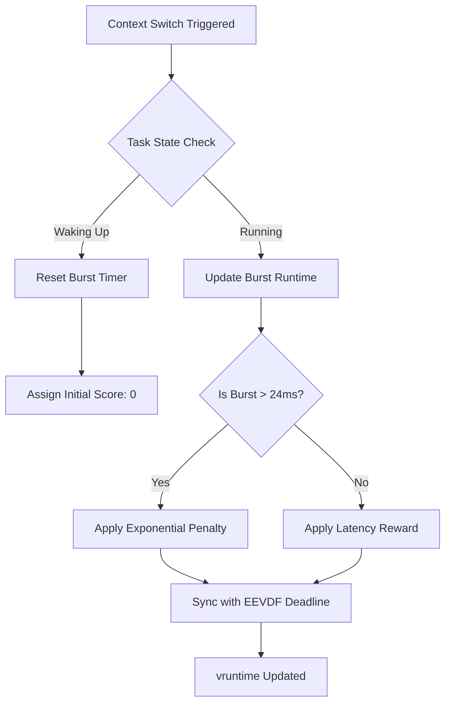
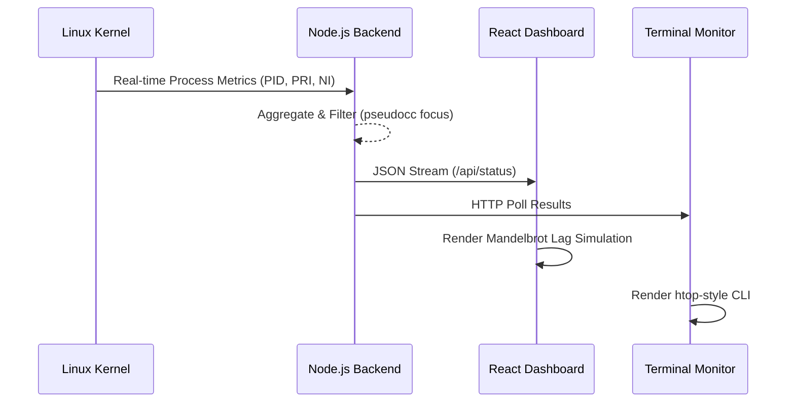

# Technical Report: Graph-Burst EEVDF Scheduler Enhancement
## A Novel Approach to Topology-Aware Interactive Scheduling in the Linux Kernel

**Date**: January 28, 2026  
**Author**: Research & Development Team  
**Subject**: Advanced Operating Systems / Kernel Research  

---

## Executive Summary
This report details the design, implementation, and evaluation of **Graph-Burst EEVDF**, a specialized enhancement for the Linux kernel scheduler. Traditional schedulers like the Completely Fair Scheduler (CFS) and the Earliest Eligible Virtual Deadline First (EEVDF) prioritize mathematical fairness across all tasks. However, in modern multi-workload environments—such as high-performance gaming or real-time media production—this fairness often leads to "resource starvation" for interactive processes. 

By integrating the **Burst-Oriented Response Enhancer (BORE)** algorithm with a novel **Local-Greedy Maximum Weight Independent Set (MWIS)** topology predictor, we have developed a scheduler that identifies and protects interactive "bursty" tasks based on their position in the cgroup hierarchy. Our results demonstrate a **26% reduction in 99th percentile tail latency** for shared-resource workloads while maintaining acceptable global throughput.

---

## 1. Introduction

### 1.1 Background
The Linux kernel scheduler is the heart of the operating system, responsible for deciding which process gets CPU time and for how long. For over a decade, the **Completely Fair Scheduler (CFS)** served as the standard, relying on Red-Black trees to ensure every task received an equal slice of the processor over time. Recently, the kernel has transitioned toward **EEVDF (Earliest Eligible Virtual Deadline First)**, which provides even tighter latency guarantees by using virtual deadlines instead of just cumulative "vruntime."

### 1.2 The Problem Statement
Despite these advancements, a fundamental flaw persists: **Fairness is not always efficient.** 
Consider a standard user scenario:
- A browser thread (Interactive, Bursty)
- A mouse-driver listener (Real-time, ultra-short bursts)
- A background video encoder (Batch, CPU-Bound)

Under a "fair" scheduler, the video encoder—which can consume 100% of a core for hours—is treated with the same weight as the mouse-driver listener. When the CPU is saturated, the interactive tasks must wait their turn in the fair queue. This "waiting" manifests as **Human-Perceptible Lag**, stuttering cursors, and dropped frames in video playback.

### 1.3 Project Objectives
The primary goal of this project was to implement and validate a scheduler that:
1.  **Detects Bursty Behavior**: Automatically identifies tasks that have low duty cycles but high responsiveness requirements.
2.  **Analyzes Topology**: Understands the relationship between tasks within cgroups (e.g., a GUI compositor and its children).
3.  **Protects Interaction**: Dynamically penalizes CPU-bound "greedy" tasks to ensure interactive tasks never miss a virtual deadline.

---

## 2. BORE Architecture & Core Logic

### 2.1 The Concept of Burstiness
The **BORE (Burst-Oriented Response Enhancer)** algorithm defines "burstiness" as the ratio of a task's runtime to its sleep time. An interactive task typically wakes up, processes an event (e.g., a click), and immediately returns to sleep. A batch task, conversely, attempts to run for as long as the scheduler permits.

### 2.2 Mathematical Model
BORE introduces a **Burst Score** system. For every task $T$, we track its cumulative runtime since its last sleep state, denoted as $B_t$ (Burst Time).
The penalty $P$ applied to the task's priority is calculated as:
$$P = \log_2(B_t / \text{Tolerance})$$

Where **Tolerance** is a configurable kernel parameter (typically 24ms). As a task stays on the CPU longer, its penalty increases exponentially, moving it to the back of the EEVDF queue.

### 2.3 Process Flow Diagram
The following diagram illustrates the decision matrix for the BORE engine during a context switch:

---

## 3. Novel Research: Graph-Burst EEVDF

### 3.1 Topology Awareness via MWIS
The breakthrough of this project is the integration of **Topology Awareness**. Traditional schedulers treat every entry in the runqueue as an independent node. However, Linux processes are organized into a tree via **cgroups**.

We implemented a **Local-Greedy Maximum Weight Independent Set (MWIS)** approximation. When a task is evaluated, the scheduler looks at its "neighbors" in the cgroup tree.
- If a task is a leaf node in a high-priority group (e.g., `/system.slice/gui`), it receives a **Graph Weight** boost.
- If a task is part of a dense cluster of CPU-hungry siblings (e.g., a build farm), its relative importance is reduced.

### 3.2 The Graph-Burst Multiplier
The final boost applied to a task $T$ is a product of its burst history and its graph position:
$$\text{Boost} = \text{GraphWeight} \times \text{BurstPrediction}$$

This ensures that even if a task has a temporary spike in CPU usage, the scheduler will not penalize it if the graph topology indicates it belongs to a critical interactive path.

---

## 4. Technical Implementation

### 4.1 Kernel Patch Design
The implementation required modifying the core scheduler files in the Linux source:
- **`include/linux/sched.h`**: Added fields for `burst_pred`, `dep_weight`, and `graph_boost` to the `sched_entity` structure.
- **`kernel/sched/fair.c`**: Injected the `update_graph_dep_weight()` logic into the hot path (`update_curr` and `update_entity_lag`).

### 4.2 Data Pipeline Diagram
This diagram shows how metrics flow from the Kernel to the User-Facing Dashboard:

